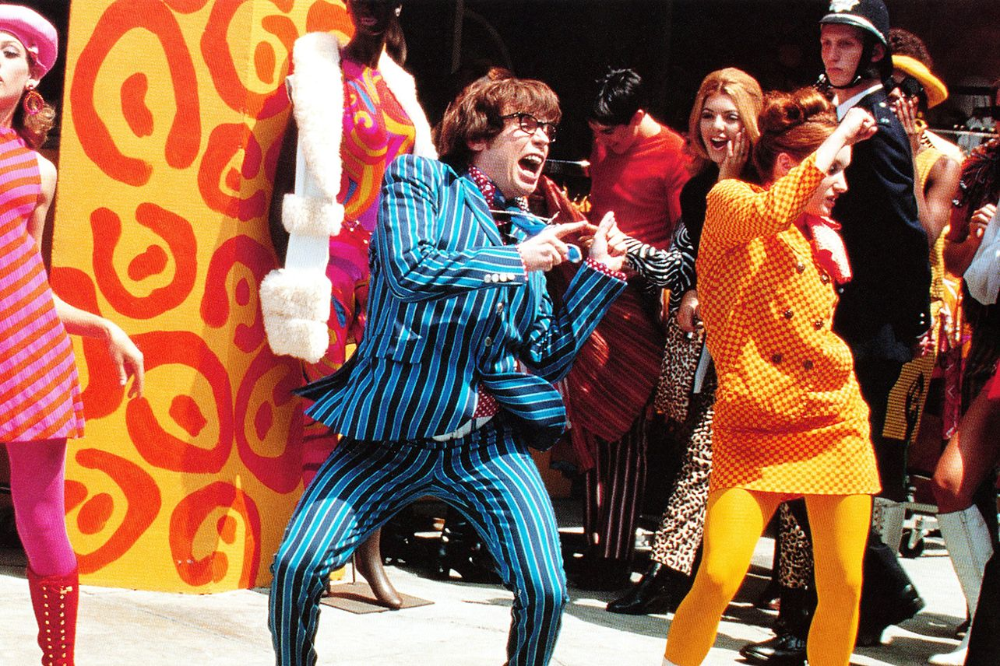

## Are pets allowed?

Unfortunately, the venue doesn't allow pets.
We're sorry but you'll have to leave your furry friends at home.

## Are children allowed?

Yes!
Bring your babies, and we'll teach them Ultimate.

## Dress

There is no dress code.
But you can help us commemmorate the occasion by wearing creative and colorful attire for the Saturday ceremony and reception.
Dress wild! The more extravagant and ugly the better.



The event will be on grass.
**Do not wear stiletto heels.**
Prefer high-performing footwear or bring a change of shoes, such that your celebrate to your fullest ability.
See [Camping](/camping) for helpful attire for the whole weekend.

## Where do I shower?

There are two shower stalls, which operate using solar bags provided by the Outfitters.
There is also a cold water shower at the shop.
The Connecticut River is also quite clean and refreshing at this latitude.
Please note that the facilities are minimal in general.

## How can I help?

We'd love your help in making our wedding special.
Here are some examples of ways you could assist, inspired by actual invitees!

- Can lend my strength for setup
- I'm a licensed airman and can take a drone video
- Can play cello
- Can bring a lawn game called King Kubb
- Have AV skills
- Have a 10kW generator you could borrow (Let us know if you have this!)
- Can make wildflower bouquets

If you'd like to offer a skill or lend an item, let us know in your RSVP or by email.

## Can I bring a +1?

If we were aware of a likely +1,
we probably named them in your invite or sent them a separate invite.
If we didn't, you can still list them as part of your party in the RSVP form or ask us separately.
And we will confirm that the additional guest doesn't exceed capacity restrictions.

## Who helped build the website?

Huge thanks to our dear friend, [Silvia Canelón](https://silvia.rbind.io), for creating this beautiful website.
And Trang's sister Ngọc for creating the invitation video.

```{r setup, include=FALSE}
library(ragg)
knitr::opts_chunk$set(echo = FALSE, warning = FALSE, message = FALSE,
                      dev = "ragg_png")
# X11Font("Homemade Apple")
# systemfonts::register_font("Homemade Apple", 
#                            plain = '~/.fonts/Qw3EZQFXECDrI2q789EKQZJob0x6XHgOiJM6.woff2')
```

```{r warning=FALSE, message=FALSE, echo=FALSE}
library(tidyverse)
library(wordcloud)
library(tidytext)
library(lubridate)
# extrafont::loadfonts()

rsvp_csv_url <- "https://docs.google.com/spreadsheets/d/1FpXd0o3heKXaLz_1s8ofhayg7Y_re5Js2sHG_gR2ub8/export?format=csv"
rsvp_raw <- readr::read_csv(rsvp_csv_url,
  col_names = c(
    "timestamp", "email", "party", "will_attend",
    "Friday, July 23rd", "Saturday, July 24th",
    "Sunday, July 25th", "will_camp", "nights",
    "missing_gear",
    "deluxe_interest", "volunteer", "notes"
  )
)[-1, ]
```

```{r}
count_attends <- function(mystr) {
  if (grepl("David Goldberg", mystr)) {
    return(3)
  }

  num_at <- str_count(mystr, "@")
  if (num_at == 0) {
    return(length(str_split(mystr, c(",", " et "))[[1]]))
  }
  num_at
}

# count_attends0 <- function(mystr){
#   x = floor(sum(!grepl("@|^$", str_split(gsub("<|>|-|,|;|+1|<no email yet what a baby>| et ", "", mystr), ' |  |\n')[[1]]))/2)
#   if (x == 0)
#     return(1)
#   x
# }
# mystr = rsvp_raw$party

# num_attends = sapply(rsvp_raw$party, count_attends0)
# num_attends2 = sapply(rsvp_raw$party, count_attends)
# checkdf=as.data.frame(num_attends) %>%
#   cbind(count2 = num_attends2)

rsvp <- rsvp_raw %>%
  mutate(num_attends = sapply(rsvp_raw$party, count_attends)) %>%
  separate(party, sep = " ", c("att_name")) %>%
  separate(email, sep = "@", c("short_email", NA), remove = FALSE) %>%
  mutate(
    att_name = str_to_title(att_name),
    activity = paste(`Friday, July 23rd`, `Saturday, July 24th`, `Sunday, July 25th`, sep = ", ")
  ) %>%
  filter(short_email != "bjohnson8949") %>%
  # remove duplicates
  select(-contains("July"))
```

## Who can make it?

```{r}
rsvp %>%
  group_by(will_attend) %>%
  summarise(n = sum(num_attends))
```

```{r}
rsvp %>%
  filter(will_attend == "Yes!!!") %>%
  group_by(will_camp) %>%
  summarise(n_camps = sum(num_attends))
```


```{r include=FALSE, eval=FALSE}
# Those who camp, camp which night?

rsvp %>%
  filter(will_camp == "Yes") %>%
  count(nights)

maybe_campers <- rsvp %>%
  filter(will_camp == "Maybe") %>%
  select(email, nights, missing_gear, deluxe_interest)
```

## Who's doing what?

```{r activity}
activity_df <- rsvp %>%
  filter(will_attend == "Yes!!!") %>%
  select(-c(will_attend, will_camp, nights, missing_gear, deluxe_interest, notes, volunteer)) %>%
  mutate(activity = activity %>%
    str_replace_all("1:30 pm|6:30 pm", "Friday") %>%
    str_replace_all("12:00 pm|4:00 pm|5:30 pm", "Saturday") %>%
    str_replace_all("9:00 am", "Sunday")) %>%
  separate_rows(activity, sep = ", ") %>%
  filter(activity != "NA") %>%
  add_count(short_email) %>%
  mutate(
    short_email = fct_reorder(short_email, n),
    activity = activity %>%
      fct_relevel("Friday Potluck Dinner", after = 1) %>%
      fct_relevel("Saturday Lunch", after = 2),
  ) %>%
  complete(short_email, activity) %>%
  replace_na(list(num_attends = 0))

activity_df %>%
  group_by(activity) %>%
  summarise(participation = sum(num_attends))
```

## What did you write us?

```{r}
notes_df <- rsvp %>%
  select(short_email, att_name, volunteer, notes) %>%
  mutate(str_replace(notes, "’", "'"))

activity_wide <- activity_df %>%
  pivot_wider(names_from = activity, values_from = num_attends)
note_counts <- notes_df %>%
  unnest_tokens(word, notes) %>%
  anti_join(stop_words)

word_counts_df <- notes_df %>%
  unnest_tokens(word, notes) %>%
  count(short_email, att_name, name = "note_words", sort = TRUE) %>%
  left_join(notes_df %>%
    unnest_tokens(word, volunteer) %>%
    count(short_email, name = "volunteer_words")) %>%
  mutate(short_email = short_email %>% fct_reorder(note_words)) %>%
  filter(note_words >= 5 | volunteer_words >= 5)

set.seed(1)
note_counts %>%
  count(word) %>%
  with(wordcloud(word, n,
    min.freq = 0, random.order = FALSE,
    colors = brewer.pal(8, "Dark2")
  ))
```

Who's responsible?

```{r fig.height=8, fig.width=8}
word_counts_df %>%
  pivot_longer(c(note_words, volunteer_words)) %>%
  ggplot(aes(y = short_email, x = value, fill = name)) +
  geom_col() +
  labs(y = NULL, x = "Number of words", fill = NULL) +
  ggpomological::theme_pomological_plain("serif", 16) +
  ggpomological::scale_fill_pomological() +
  theme(legend.position = "None",
        axis.title = element_text(face="italic"),
        axis.text = element_text(face="italic"),
        panel.border = element_blank()
        ) +
  scale_y_discrete(labels = rev(word_counts_df$att_name)) +
  coord_cartesian(expand = FALSE) +
  NULL
```
