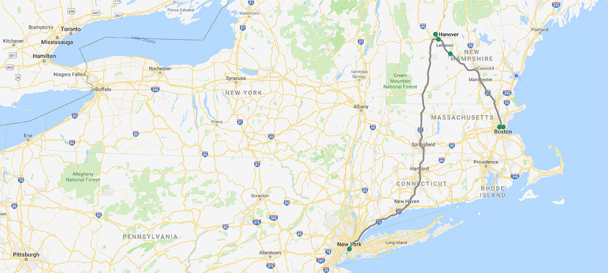

```{r setup, include=FALSE}
knitr::opts_chunk$set(echo = FALSE)
```

There will be guest parking at the venue.

If you can't drive / bike to the venue, consider any of the following options:

## Air

- [Boston Logan International Airport](https://www.massport.com/logan-airport/) (BOS),
  with [global service](https://www.flightconnections.com/flights-to-boston-bos).
- [Manchester-Boston Regional Airport](https://www.flymanchester.com/) (MHT).
  [serviced](https://www.flightconnections.com/flights-to-manchester-mht) by American, United, and Southwest.
- [Lebanon Municipal Airport](https://lebanonnh.gov/150/Airport) (LEB),
  serviced by Cape Air with [flights from](https://www.flightconnections.com/flights-from-lebanon-leb) BOS (JetBlue codeshare) and White Plains (HPN).
  There is little convenience to these flights over ground transportation,
  but the small planes do make for a memorable experience.

## Ground

### Bus

The [Dartmouth Coach](https://dartmouthcoach.com/) from Boston or NYC to Lebanon, NH or Hanover, NH.
Boston service picks up at Logan Airport (BOS) or South Station.
New York service leaves from Midtown Manhattan between Lexington and 3rd Avenue at 150 East 42nd Street, New York, NY 10017.



### Train

The Amtrak [Vermonter Line](https://www.amtrak.com/vermonter-train) is slated to resume service on July 19.
Northbound service [arrives](https://www.amtrak.com/content/dam/projects/dotcom/english/public/documents/timetables/Vermonter-Schedule-P55-031620.pdf) to the Windsor, VT station at 5:56 pm daily.
Southbound service departs Windsor at 11:56 am daily.
The Windsor, VT Amtrack station is just [3 miles](https://goo.gl/maps/ijRdsDQaRDRJXgS5A) from the Venue!
The White River Junction Amtrak station is further north,
and is better if you'd like to stop by Norwhich, VT or Hanover, NH before of after the event.


## Carpool

For guests that don't have a car or need a local pick-up,
hopefully we can help coordinate that with other guests.
If you think you will need a ride or might be able to offer a ride,
put your information in [this spreadsheet](https://docs.google.com/spreadsheets/d/1c_IF5f0gY2EpwDWvSkv1FamWb_bG4eqKfgozGD8xTK8/edit).

## Lodging

See [Camping](camping) for on-site and off-site lodging info.

## Map

<iframe src="https://www.google.com/maps/d/u/0/embed?mid=1g9SPRlTdjVpiS7HSqSxd1y2EVr-wGO_T" width="640" height="480"></iframe>
