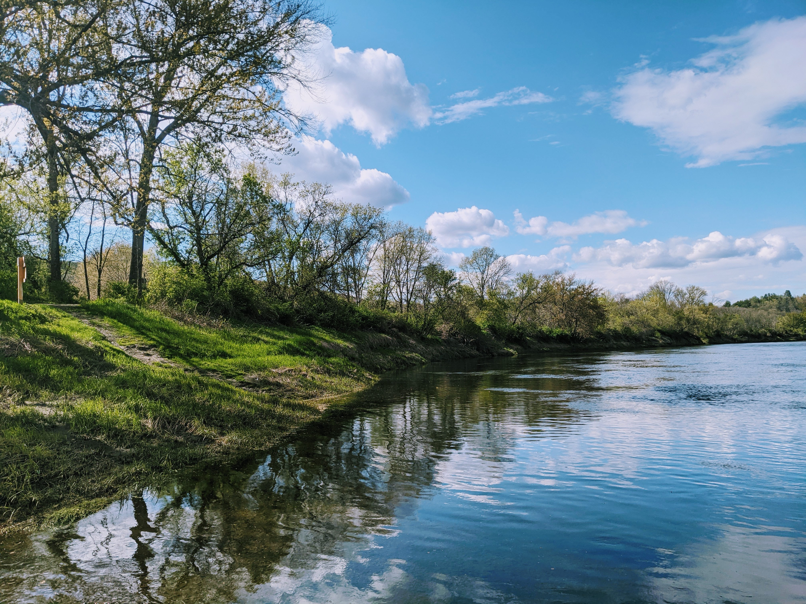
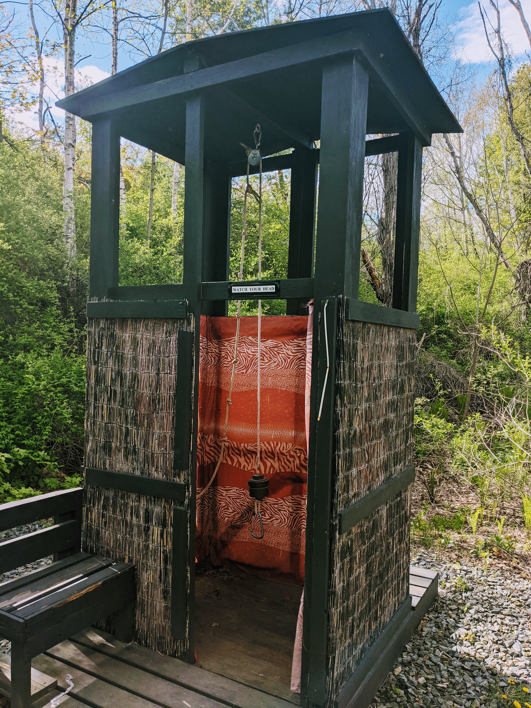
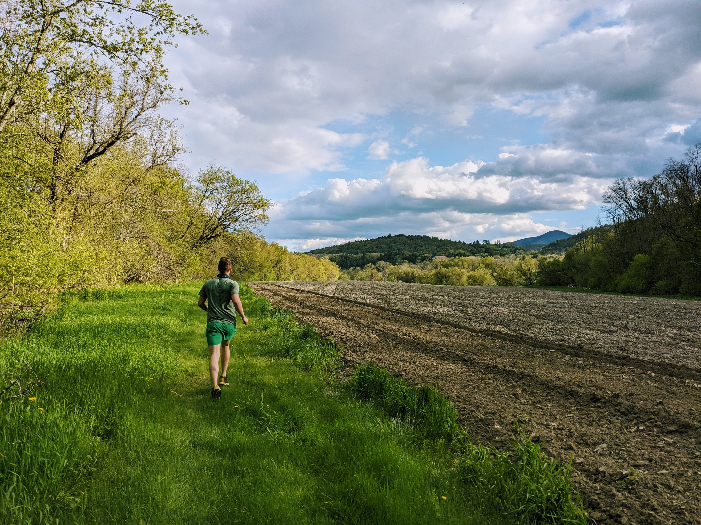

```{r setup, include=FALSE}
knitr::opts_chunk$set(echo = FALSE)
```

The event will be at the [**Path of Life Sculpture Garden**](https://greatriveroutfitters.com/news-and-events/welcome-to-the-path-of-life-sculpture-garden),
which is operated by [Great River Outfitters](https://greatriveroutfitters.com).

The venue is located in [Artisan's Park](https://www.artisanspark.net/), a "collection of 8 unique Vermont businesses."
Once at Artisan's Park, you enter the garden through the Great River Outfitters shop,
passing through the _Tunnel of Despair_ under the railroad track.
The garden is enclosed on one side by the railroad and the other by the mighty Connecticut River.

Address:

- 36 Park Road, Windsor, Vermont 05089
- On [Google Maps](https://www.google.com/maps/place/Path+of+Life+Sculpture+Garden/@43.5134707,-72.3999229,15z/data=!4m2!3m1!1s0x0:0xe51fd9530f5b7312?sa=X&ved=2ahUKEwilzc7qlc7wAhWWWc0KHbcWCGAQ_BIwG3oECEMQBQ)
- On [OpenStreetMap](https://www.openstreetmap.org/way/308153779#map=18/43.51397/-72.40171)

Venue Contact:

- Shop Phone: [+1-802-674-9933](tel:+1-802-674-9933)
- Craig's Cell: [+1-802-345-8248](tel:+1-802-345-8248)

## Notes

- No pets allowed


## Additional links

- [Sculpture guide](https://greatriveroutfitters.com/news-and-events/path-of-life-garden-guide-a-map)
- [Artisan Park](http://www.artisanspark.net/)
- [Camping map](https://greatriveroutfitters.com/images/files/CampingMap2019-1.pdf)

## Additional photos





.](img/tent3.jpg)




