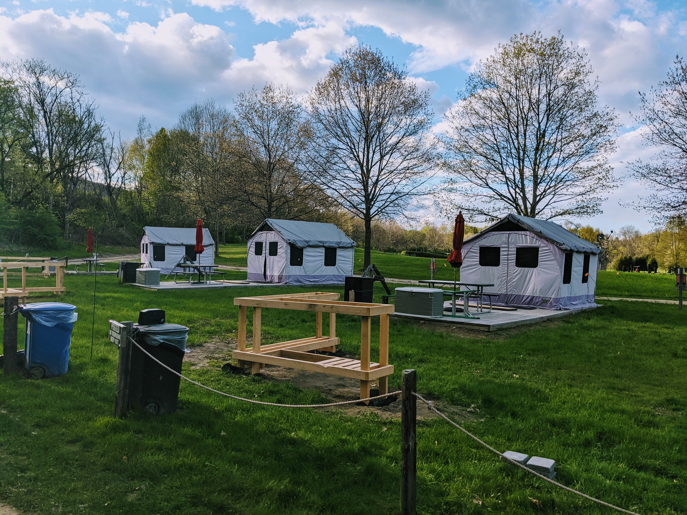

```{r setup, include=FALSE}
knitr::opts_chunk$set(echo = FALSE)
```

[**Path of Life Sculpture Garden**](https://greatriveroutfitters.com/news-and-events/welcome-to-the-path-of-life-sculpture-garden)

Address: 36 Park Road Windsor, Vermont 05089. [Map](https://www.google.com/maps/place/Path+of+Life+Sculpture+Garden/@43.5134707,-72.3999229,15z/data=!4m2!3m1!1s0x0:0xe51fd9530f5b7312?sa=X&ved=2ahUKEwilzc7qlc7wAhWWWc0KHbcWCGAQ_BIwG3oECEMQBQ)

Phone: (802) 674-9933

## Additional links

- [Sculpture guide](https://greatriveroutfitters.com/news-and-events/path-of-life-garden-guide-a-map)

- [Artisan Park](http://www.artisanspark.net/)

- [Camping map](https://greatriveroutfitters.com/images/files/CampingMap2019-1.pdf)

## Additional photos





