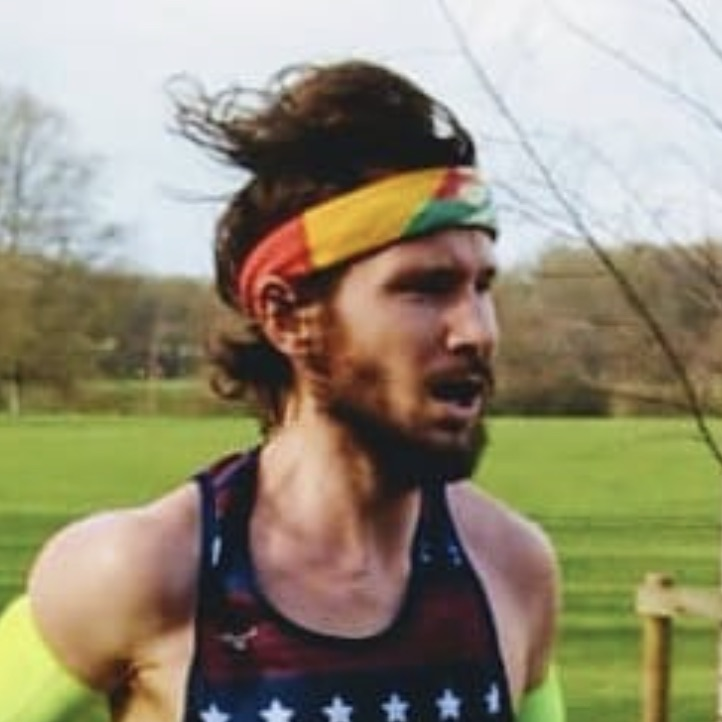

```{r setup, include=FALSE}
knitr::opts_chunk$set(echo = FALSE)
```

<center>
<div class="wrapper">
<div class="adjust-line-height-medium">
Ông bà:

<p style="font-size:20px; font-style:italic">
*Lê Đình Lăng*
<br/>
<br/>
*Nguyễn Thị Hà*
</p>
Vũng Tàu, Bà Rịa — Vũng Tàu 
</div>
<div class="adjust-line-height-medium">
Ông bà:

<p style="font-size:20px; font-style:italic">
*Marty Himmelstein*
<br/>
<br/>
*Becky Hirschey*
</p>
Hanover, NH
</div>
</div>

<br>

Trân trọng báo tin **Lễ Thành Hôn** của con chúng tôi:


<div class="adjust-line-height">
<br>
<p style="font-family: 'Mea Culpa'; font-size:35px; font-style:italic">
*Daniel Himmelstein*
</p>

<p style="font-family: 'Mea Culpa'; font-size:35px; font-style:italic">
&
</p>
<p style="font-family: 'Mea Culpa'; font-size:35px; font-style:italic">
*Lê Thảo Trang*
</p>
</div>

<br>
Hôn lễ sẽ được cử hành tại/
The celebration will be at 
<div class="adjust-line-height-small">
<br>
<p style="font-size:24px; font-style:italic">
**Palace Hotel**
</p>
1 Nguyễn Trãi, Phường 1, thành phố Vũng Tàu
<br>
</div>
<br>
vào lúc 18 giờ 30 phút
<div class="adjust-line-height-small">
<br>
**_Thứ Hai, ngày 26 tháng 12 năm 2022_**

**_Monday, December 26, 2022_**

(nhằm ngày 04 tháng 12 năm Nhâm Dần)
</div>
<br>

Sự hiện diện của quý khách là niềm vinh hạnh cho gia đình chúng tôi.

Trân trọng kính mời!

</center>

## For alien visitors

*Welcome!*

We're thrilled that you're coming to visit Trang's beautiful hometown!

We're working on a [***Viet Nam must-read***](https://lively-candy-457.notion.site/Vietnam-must-sees-1d29e420e65047acbb8f0a8c80fc7582) Notion page.

[{width=100%}](https://lively-candy-457.notion.site/Vietnam-must-sees-1d29e420e65047acbb8f0a8c80fc7582)

We include some crucial information below, but please check out the Notion page for more detail.
And, of course, let us know if you have any additional questions.

### Events

The wedding will take place on Monday, December 26,
in the peninsular city of Vũng Tàu where one can watch both sunrise and sunset over the ocean.
In the morning, there will be an engagement _ceremony_ called Đám Hỏi,
where the groom's family & friends present dowric offerings to the bride's family
(at their residence).
Then comes a _luncheon_.
And finally an evening wedding _reception_ at the Palace Hotel.

On the eve of the wedding, December 25, dinner will be served on the street outside the Lê residence.
On the morning after the wedding, December 27, a tentative ~10k group run [is routed](https://www.strava.com/routes/3034331992723735468 "Tentative Strava route for the 10k Loveroo Club Vung Tao run.").

<!--  -->

### Lodging

If you would like to stay at the 4-star [Palace Hotel](https://goo.gl/maps/mbVEmU1ok68hXiRw7),
you can book via Priceline, Booking.com, Expedia, etc.
The nightly rate is around $50 including breakfast.
There are a few AirBnB options but they can be a little further away from city center.

<aside>
The hotel finds it too logistically challenging to offer any group discount.
</aside>

## Travel

We will be in Viet Nam from Nov 27 to Dec 28, 2022.
Let us know when you arrive so Trang can be your guide for a few days!

### Vung Tau

The closest airport to Vung Tau is SGN (Saigon / Ho Chi Minh City).
To get to Vung Tau, there are shuttles from the airport every 20 mins or so, unless you arrive at a strange time.
You should see a shuttle lane when you get outside.
Make sure to tell them you're going to [Vung Tau](https://youtu.be/gld41YRCqC0).
Cost is ~$10/person and the shuttle will take you to your exact address.
Depending on traffic, travel time is 2—2.5 hours.
Some popular shuttle companies are: Hoa Mai, Thanh Vinh, Toan Thang, Huy Hoang, and Anh Quoc.

### Hoi An

Hội An is a site of world heritage in central Vietnam.
We have booked **group lodging** in a 7 bedroom villa overlooking the rice paddies for anyone who'd like to join.
The villa is reserved from **December 16--22** (Friday--Thursday).

The villa is in the Cẩm Thanh village and is referred to as "_The An Retreat Hoi An by Đặng Viết Đồng_".
Details can be found on [facebook](https://www.facebook.com/dang.v.dong/posts/pfbid0SUdbBASg7Q63bxxkivRv5VpnbXj5huEPDUUy9Ryu4MjgAmqXE3QsNcSWmgbk43XLl
0) and [airbnb](https://www.airbnb.com/rooms/620873204365705719).
We'll try to acquire world-class amenities:
an occasional private chef and bicycles for all.
The GPS location is `15.88536, 108.35432`
(see on [Google](https://goo.gl/maps/DYeV8MEFa2yFjoWe7) or [OpenStreetMap](https://www.openstreetmap.org/way/286421500)),
which is roughly this address:

> Tống Văn Sương, Hamlet 5  
> Hội An, Quảng Nam 560000, Vietnam

To get to Hội An, fly to Đà Nẵng Airport ([DAD](https://www.flightconnections.com/flights-from-da-nang-dad)).
This will be a cheap domestic flight and is probably easiest to book separately from your flight to Vietnam.

Consider booking the official return flight to Ho Chi Minh following the Hoi An stay: **Vietnam Airlines 117, DAD to SGN, 22 Dec 2022** at 12:25 PM ([Google Flights](https://www.google.com/travel/flights/s/zYkwpNr6KPjmbwpf9)).
At time of writing, the _Economy Super Lite_ fare (excludes a checked bag) was priced at 807,000 VND ($33) and _Economy Lite_ (includes a checked bag) at 1,077,000 VND ($43).
You can enter your Delta frequent flyer number to earn SkyMiles for this flight.

### Việt Nam visa

Foreign visitors will need a visa.
If your stay does not exceed 30 days and includes only a single entry into Vietnam,
you can get an [e-visa here](https://evisa.xuatnhapcanh.gov.vn/en_US/web/guest/khai-thi-thuc-dien-tu/cap-thi-thuc-dien-tu).
The e-visa process is entirely online, takes ~3 days to process, and costs $25.
We recommend paying with a credit card with no foreign transaction fee. 

For other types of visas, see the [USA Embassy site](https://vietnamembassy-usa.org/consular/visa-application-process) for more information.
We will provide you with the contact details for Trang's father,
should the visa requires a sponsor or destination address.

Please let us know if you have any further questions!

_Reading_:

- [Vietnam International Travel Information (state.gov)](https://travel.state.gov/content/travel/en/international-travel/International-Travel-Country-Information-Pages/Vietnam.html#/)

- [vietnamembassy-usa.org](https://vietnamembassy-usa.org/consular/visa-application-process)

### Monie

1 USD ~= 23,000 VND

The best way to get Viet Nam Dong (VND) is from an ATM, so bring a debit card!
We're not sure how much the Exchange Booths in Viet Nam overcharge you, but we generally avoid them at other airports!

There are [2 ATMs in the arrivals hall](https://www.theworldinmypocket.co.uk/how-not-to-get-scammed-at-saigon-ho-chi-minh-city-airport/) at SGN airport: a _BIDV_ and a _citibank_, facing each other.
If you're taking a taxi from the airport, you can also ask them to stop at an ATM on the way to your destination.
The ATM fee is usually ~3% of the amount you withdraw.

We also recommend bringing some USD cash with you from the US.
You can always go to any bank in Viet Nam to exchange to VND
(no fee, unlike the Exchange Booth).
<!-- # TODO: check with mum on this -->

<aside>
There is no limit but if you're bringing more than $5,000, be sure to declare at customs.
</aside>

_Reading_:

- [ATMs in Ho Chi Minh City | i Tour Vietnam Blogs (itourvn.com)](https://www.itourvn.com/blog/is-it-easy-to-get-money-out-of-atms-in-ho-chi-minh-city)

- [How NOT to get scammed at Saigon Airport (theworldinmypocket.co.uk)](https://www.theworldinmypocket.co.uk/how-not-to-get-scammed-at-saigon-ho-chi-minh-city-airport/)


### Meet the aliens


::: {.floatting}

```{r out.width='30%', out.extra='style="float:left; padding:10px"'}

```

**Isabelle** received her doctorate degree at Harvard where she constructed indicators using feature engineering to characterize decentralization as a latent variable and its relationship with program performance.
<!-- Isabelle has published many high impact articles such as "Equally able, but unequally accepted: Gender differentials and experiences of community health volunteers promoting maternal, newborn, and child health in Morogoro Region, Tanzania". -->
She can't wait for an adventurous time in Viet Nam sans children.


:::


::: {.floatting}

```{r out.width='30%', out.extra='style="float:left; padding:10px"'}

```

**Antoine** is the father of two beautiful children, at least one of whom is with Isabelle.
He is thrilled to be making his Loveroo Club debut.

:::


::: {.floatting}

```{r out.width='30%', out.extra='style="float:left; padding:10px"'}

```

**Jason** is an avid skier who also dabbles in competitive ultimate, marathon running, and gravel biking. 
Jason ăn chay and cannot wait to explore what the Viet cuisine has to offer.

:::


::: {.floatting}

```{r out.width='30%', out.extra='style="float:left; padding:10px"'}

```

**Robert** is a Cornell graduate and has been one of Elon Musk's best mentees for several years.
Robert is passionate about renewable energy and wishes to invest in solar panels for Southeast Asia.

:::

::: {.floatting}

```{r out.width='30%', out.extra='style="float:left; padding:10px"'}

```

**Nathaly** a chemical engineer who speaks 4 languages and cooks 12 different cuisines.
She was last seen in Mexico but you may find her hosting an impromptu dinner in the Greater Philadelphia Area region.
Nathaly is excited to visit Viet Nam and 5 more other countries on her way there.

:::

::: {.floatting}

```{r out.width='30%', out.extra='style="float:left; padding:10px"'}

```

**Luis** will be meeting Trang and Daniel for the first time in Viet Nam.
He looks forward to be completely showered with strangers' love.

:::

::: {.floatting}

```{r out.width='30%', out.extra='style="float:left; padding:10px"'}
knitr::include_graphics("img/Isabel.jpeg")
```

**Isabel** is a published author!
For readers who can read Spanish, there will be a book signing by the beach after the celebration.
Congratulations, Isabel!

:::


::: {.floatting}

```{r out.width='30%', out.extra='style="float:left; padding:10px"'}

```

**Ariel** is a Cuban engineer who is expecting!
Ariel is excited to be back to play witness in his third Loveroo union.

:::


::: {.floatting}

```{r out.width='30%', out.extra='style="float:left; padding:10px"'}

```

**Kurt** is a free Philadelphian spirit who officiated out first two weddings.
He is excited to enjoy this year's celebration without any responsibility.

:::

::: {.floatting}

```{r out.width='30%', out.extra='style="float:left; padding:10px"'}
knitr::include_graphics("img/corey.jpg")
```

**Corey** is of House Hilton from New Rochelle, New York.
Corey is Daniel's fraternity brother,
which is a non-blood relationship from a collegiate social group.
If you need help with any Slick Deals, consult Corey.

:::


::: {.floatting}

```{r out.width='30%', out.extra='style="float:left; padding:10px"'}

```

**Joshua** is the true blood brother of Daniel.
He flies drones and studies coastal geology.
Joshua is considered more charming than Daniel,
in part because of his superior patience.

:::

::: {.floatting}

```{r out.width='30%', out.extra='style="float:left; padding:10px"'}

```

**Sally** is a PhD student of North Carolina and yogi.
Her and Joshua like to surf the seas and dive the depths.
:::


<!-- ::: {.floatting} -->
<!-- ```{r out.width='30%', out.extra='style="float:left; padding:10px"'} -->
<!--  -->
<!-- ``` -->

<!-- **Angie** is an economist who studies the effect of fiscal policies on gender equality in African countries. -->
<!-- Angie looks forward to return to Viet Nam to collect de-identified data for her research. -->
<!-- And to celebrate love, of course. -->

<!-- ::: -->

<!-- ::: {.floatting} -->
<!-- ```{r out.width='30%', out.extra='style="float:left; padding:10px"'} -->
<!--  -->
<!-- ``` -->
<!-- **Sam** received the highest conjugal award at our last celebration and is excited to be competing in the third wedding as the (for)reigning champion. -->

<!-- ::: -->
